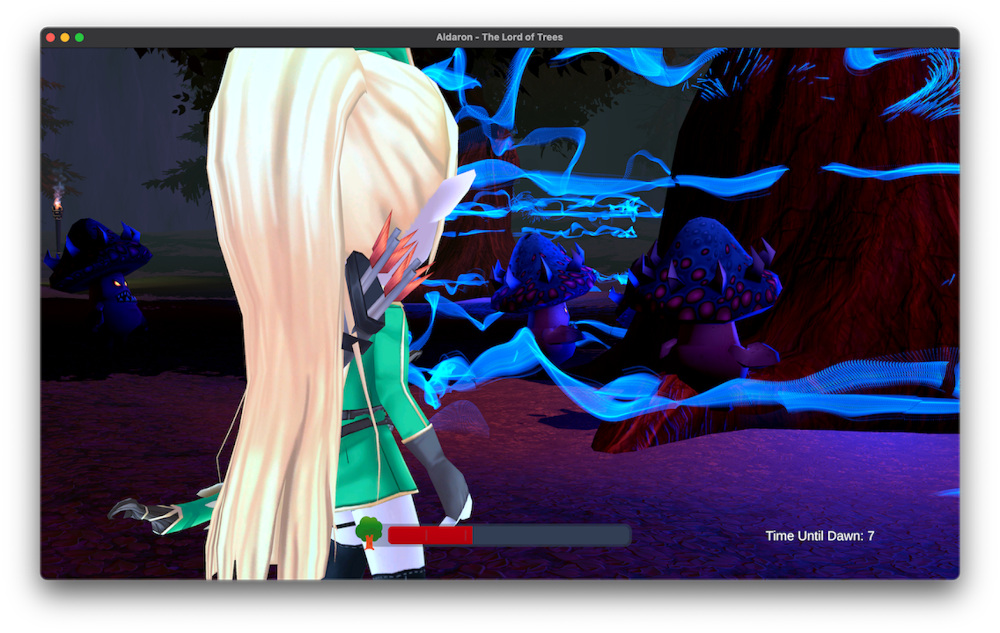
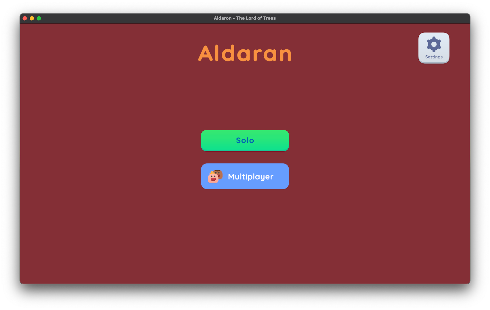
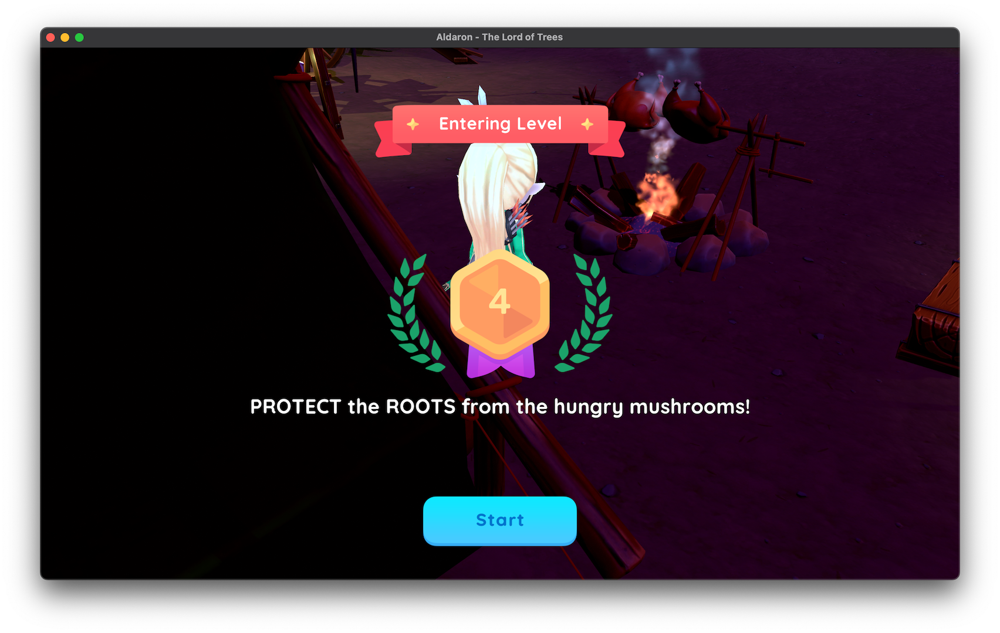
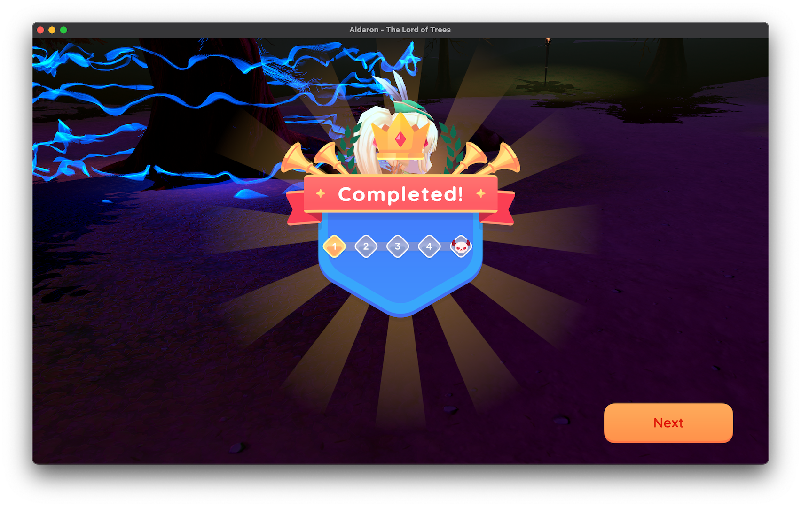
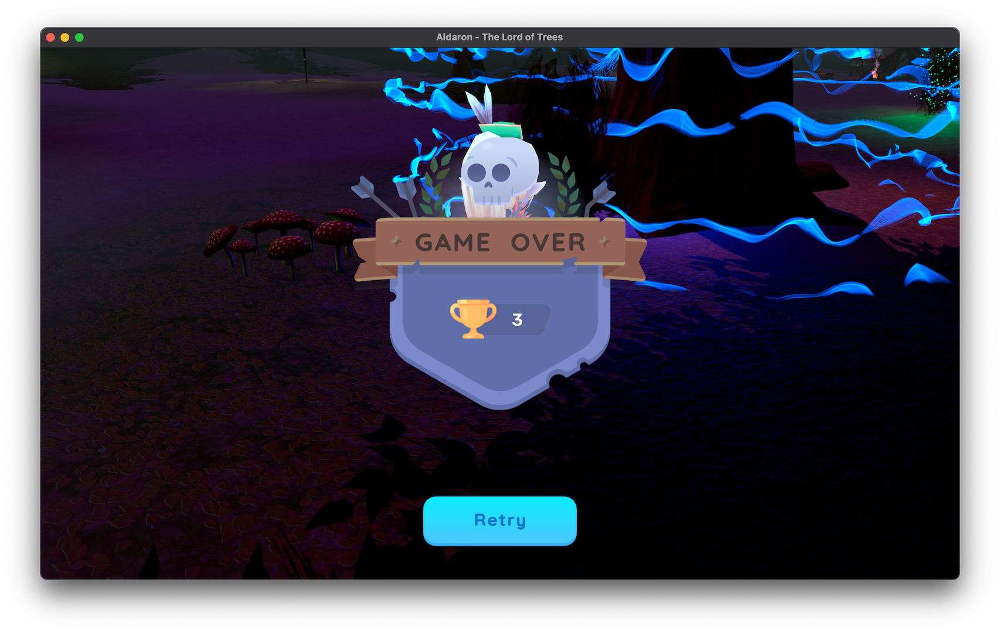

## Aldaron -  The Lord of Trees!
*This game was built for Global Game Jam 2023*

### About the Game
In "Aldaron - The Lord of Trees", players take on the role of an Elf tasked with protecting the roots of the Ancient Tree from evil mushrooms during the night. Utilizing the Elf's abilities, players must defend the tree by fighting off the evil mushrooms until dawn. The game features a Zelda-like gameplay, where players control the Elf using WASD and rotate the camera with the mouse. As the game progresses, more evil mushrooms spawn, making it harder to protect the tree. The Ancient Tree's health bar decreases as the evil mushrooms eat its roots and the timer decreases until dawn arrives. In Multiplayer mode, players must work together in co-op to save the tree before the time limit is reached. As the game progresses, the level increases. Beat all 5 levels!

Note: Press Escape to release the mouse and escape again to capture it.

---

## Screenshots

Gameplay

Select Game Mode

Starting a Level

Winning a Level

Losing

## Credits
* Adam - Lead Developer
* Carly - Level Designer
